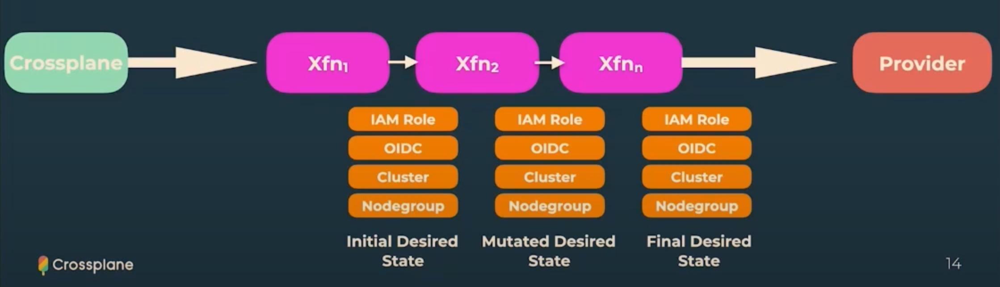
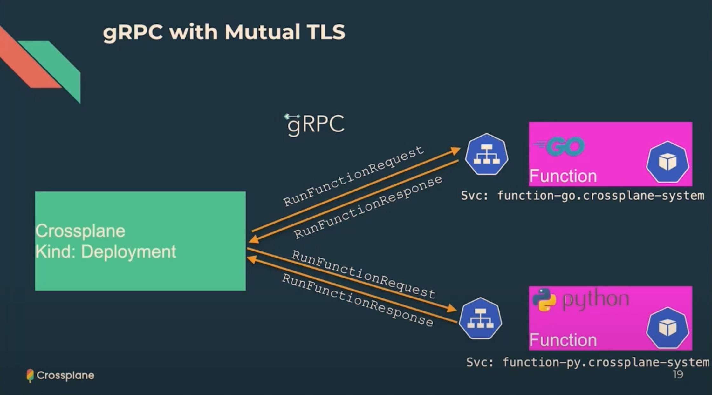

# Crossplane Composition Functions

## Links

* [Video By Shahrooz Aghili](https://www.youtube.com/watch?v=)
* [Video By Steven Borrelli](https://www.youtube.com/watch?v=n0j5WiavXEI)
* [Intro to Crossplane - Video by Shahrooz Aghili ](https://youtu.be/iqc2VAxsH_s)
* [Crossplane Compositions vs Terraform Modules - Video by Shahrooz Aghili ](https://www.youtube.com/watch?v=Ysg-u2ba88I)
* [How to Write a Crossplane Composition Function in Go](https://docs.crossplane.io/knowledge-base/guides/write-a-composition-function-in-go)
* [Crossplane](https://crossplane.io/)
* [Docs](https://docs.crossplane.io/)

## Why Functions?

> **Crossplane** is an advanced tool for managing infrastructure in the cloud-native ecosystem. 
> Crossplane encourages platform engineers to compose their cloud resources by defining their tailor made compositions.
> Compositions can be simply written as an array of resources. This is somehow similar to how 
> Terraform allows platform engineers to define modules and compose terraform resources.

> As Crossplane is an extension to the kuberenets api, the resources need to be defined as
> an array in `yaml`. This makes the configuration management a tedious task, especially if the composition
> consists of many resources. There will be too much yaml to handle. 
> Starting from version `1.11`, crossplane introduced the `v1alpha1` version of the composition functions.
> With version `1.14` the functions api is versioned at `v1beta1`. 

## Limitations of Compositions
Managing resources with an array has this limitations.

### loops
There is no way to loop through a list to provision resources
```
for subnet in subnets
    provision subnet
```

### Conditionals

```
if condition is true then
    provision ManagedInstance
```

### Flexibility

Functions are developed in separate release cycles as crossplane core. 
That makes updates more flexible.

## Functions Goals
The crossplane team aims to achive these goals with functions

* **NOT** to build a domain specific language (DSL) in yaml
* Support complex logic
* Able to write in any language (or use any text-processing tool)
* Easy to write, share and run
* Enable Multi-step pipelines
* Scalability


## How it works

When using functions, compositions need to define a pipeline. The pipeline is most analogous to a unix pipeline.
Just like in unix pipelines the stdout of one command is piped as stdin to the next one, in crossplane a yaml or json represenation of the
desired state is passed into functions. Each function in the pipeline can mutate the state but may not omit any data from the state.
Eventually after the pipeline is done, the final desired state is fed into the crossplane provider.


<figcaption>From Steven Borrelli's presentation at OSSummit 2023</figcaption>
   

## Functions Benefits

* **Modularity**: Allows for reusable code, simplifying management of complex compositions.

* **Abstraction**: Provides higher-level abstraction, focusing on desired outcomes rather than implementation details.

* **Code Reusability**: Enables easy code reuse, reducing duplication and improving organization.

* **Dynamic Configurations**: Supports variables, conditionals, and loops for flexible composition definitions.

* **Ecosystem Integration**: Integrates with existing libraries, tools, and languages for defining compositions.

### Functions Internals
Functions are OCI (Docker) Containers.
Each Container is a gRPC server which interacts with crossplane providers.
Crossplane providers sends a `RunFunctionRequest` to the function along with the desired state (yaml text) 
and gets back a `RunFunctionResponse` with the mutated desired state (modified yaml). And that's all there is to it... :D


<figcaption>From Steven Borrelli's presentation at OSSummit 2023</figcaption>

```protobuf
message RunFunctionRequest {
    RequestMeta meta = 1;
    State observed = 2;
    State desired = 3;
    optional google.protobuf.Struct input = 4;
}
```


## Playbook

### Clone the repo
```
git clone git@github.com:aghilish/function-add-k8s-labels-annotations.git
cd function-add-k8s-labels-annotations

```

### Build and Push the OCI container image


```shell
# Run code generation - see input/generate.go
$ go generate ./...
# Run tests - see fn_test.go
$ go test ./...

$ export TAG=v0.0.1

$ docker image build --tag c8n.io/aghilish/function-add-k8s-labels-annotations:$TAG .

$ docker image push c8n.io/aghilish/function-add-k8s-labels-annotations:$TAG

$ yq --inplace ".spec.package = \"c8n.io/aghilish/function-add-k8s-labels-annotations:$TAG\"" example/production/functions.yaml
```

## Running locally
You can run your function locally and test it using `crossplane beta render`
with these example manifests.

```shell
# Run the function locally
$ go run . --insecure --debug
```

```shell
# Then, in another terminal, call it with these example manifests
$ cd example/local
$ crossplane beta render xr.yaml composition.yaml functions.yaml -r
```

## Build runtime image 
```shell
# Build the function's runtime image - see Dockerfile
$ docker build . --tag=runtime

# Build a function package - see package/crossplane.yaml
$ crossplane xpkg build -f package --embed-runtime-image=runtime
```

## Production Deployment
```shell
$ kind create cluster --wait 5m

$ helm repo add crossplane-master https://charts.crossplane.io/master --force-update

$ helm upgrade --install crossplane --namespace crossplane-system --create-namespace crossplane-master/crossplane --devel --set "args={--debug,--enable-usages}"

$ cd example/production

$ kubectl apply -f functions.yaml

## wait untily healthy
$ kubectl get function -w

$ kubectl apply -f composition.yaml
$ kubectl apply -f xrd.yaml

$ kubectl apply -f aws-provider.yaml
$ kubectl apply -f aws-providerconfig.yaml

$ kubectl create secret generic aws-creds -n crossplane-system --from-file=creds=./aws-credentials.txt
# The Example Claim creates a VPC and InternetGateway. After the
# composition pipelines are complete, each resource should have
# the labels and annotations in the Composition pipeline input added.
$ kubectl apply -f claim.yaml

```

### Destroy Infrastructure

```shell
$ kubectl delete -f claim.yaml
$ kind delete clusters kind
```