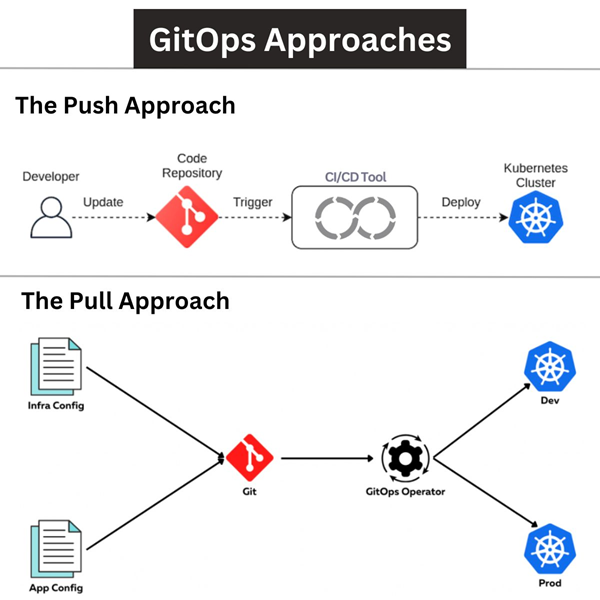

# GitOps and Argo CD

## Links

* [Video by Shahrooz Aghili on Argo CD](https://youtu.be/v=)
* [Argo CD](https://argoproj.github.io/cd/)
* [Docs](https://argo-cd.readthedocs.io/en/stable/)
* [The DevOps Toolkit](https://www.youtube.com/c/DevOpsToolkit/videos) has several great explanations and tutorials around GitOps and ArgoCD

## Why Argo CD

> **Argo CD** represents a significant leap in the domain of DevOps, particularly in the adoption of GitOps principles.

Argo CD is a part of the Argo project and a [CNCF Graduated project](https://landscape.cncf.io/?selected=argo).

## Pull vs. Push Model in GitOps

* Internal Agent
  * In the pull model, an internal agent within the cluster actively checks for changes.
* Enhanced Security
  * Pull model reduces attack vectors compared to external push triggers.
* Self-Managed
  * Clusters can self-manage and update without external dependencies.
* Consistent State
  * Ensures the cluster state is always consistent with the repository.
* Resilience
  * Pull systems are not dependent on external services for deployment.
* Cluster Autonomy
  * The cluster autonomously applies approved changes.
* Reduced Credentials Exposure
  * No need for credentials to be stored outside the cluster.
* Scalability
  * Pull model scales better as it offloads the work to individual clusters.
* Event-Driven Updates:
  * Can be configured to update based on events, making it more dynamic.
* Lower Overhead
  * Less overhead on CI systems as the cluster handles the deployment work.

## Benefits

* Enhanced Security
  * Leverages Git's robust security features, ensuring that only approved changes are deployed.
* Automated Synchronization
  * Automatically syncs the current state with the desired state defined in Git.
* Easy Rollbacks
  * Facilitates easy rollback to previous states in case of failures.
* Declarative Setup
  * Encourages infrastructure as code, improving consistency and traceability.
* Reduced Complexity
  * Simplifies complex deployments with its user-friendly interface.
* Open Source
  * No cost for usage and open to community contributions.
* Real-Time Monitoring
  * Provides a real-time view of the application's status.
* Multi-Cluster Support
  * Manages deployments across multiple Kubernetes clusters.
* Self-Healing
  * Automatically corrects detected drifts from the desired state.
* Community Support
  * Benefits from the support and innovation of the community.

[Hands on Exercise](https://roozy-io.github.io/idp/tools/argocd.html)
