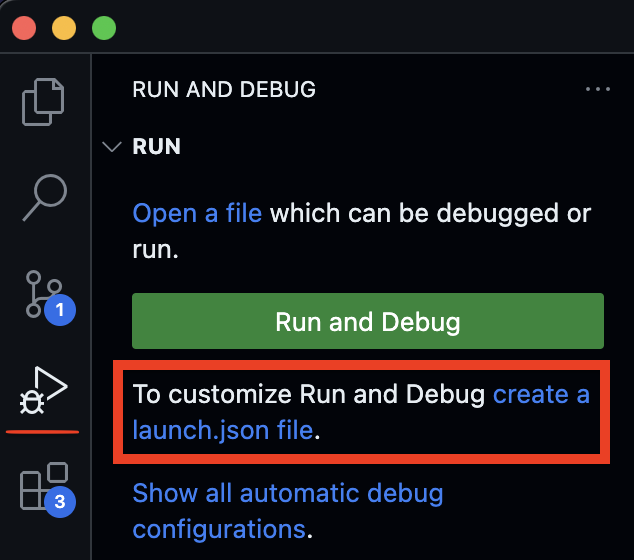

# Extending k8s api like a pro.

# Links
* [Video by Shahrooz Aghili](https://www.youtube.com/watch?v=)

# Learning Resources

1. [Extending k8s](https://kubernetes.io/docs/concepts/extend-kubernetes/)
2. [Custom Resources](https://kubernetes.io/docs/concepts/extend-kubernetes/api-extension/custom-resources/)

# Notes

> Kubernetes is highly configurable and extensible. As a result, there is rarely a need to fork or submit patches to the Kubernetes project code.

> Extension Points [Details](https://kubernetes.io/docs/concepts/extend-kubernetes/#key-to-the-figure)


## In this tutorial we will be focusing on extension point 2 (Kubernetes API).
| Declarative APIs | Imperative APIs |
|-----------------|-----------------|
| Your API consists of a relatively small number of relatively small objects (resources). | The client says "do this", and then gets a synchronous response back when it is done. |
| The objects define configuration of applications or infrastructure. | The client says "do this", and then gets an operation ID back, and has to check a separate Operation object to determine completion of the request. |
| The objects are updated relatively infrequently. | You talk about Remote Procedure Calls (RPCs). |
| Humans often need to read and write the objects. | Directly storing large amounts of data; for example, > a few kB per object, or > 1000s of objects. |
| The main operations on the objects are CRUD-y (creating, reading, updating and deleting). | High bandwidth access (10s of requests per second sustained) needed. |
| Transactions across objects are not required: the API represents a desired state, not an exact state. | Store end-user data (such as images, PII, etc.) or other large-scale data processed by applications. |
| | The natural operations on the objects are not CRUD-y. |
| | The API is not easily modeled as objects. |
| | You chose to represent pending operations with an operation ID or an operation object. |

> Kubernetes is designed to be automated by writing client programs. Any program that reads and/or writes to the Kubernetes API can provide useful automation. Automation can run on the cluster or off it.

> There is a specific pattern for writing client programs that work well with Kubernetes called the controller pattern. Controllers typically read an object's `.spec`, possibly do things, and then update the object's `.status`.


```shell
kind create cluster
```

let's start by using the `custom resource definition` api of kubernetes. 
let's create a custom resource called `CronTab`

```shell
kubectl apply -f - << EOF
apiVersion: apiextensions.k8s.io/v1
kind: CustomResourceDefinition
metadata:
  # name must match the spec fields below, and be in the form: <plural>.<group>
  name: crontabs.stable.example.com
spec:
  # group name to use for REST API: /apis/<group>/<version>
  group: stable.example.com
  # list of versions supported by this CustomResourceDefinition
  versions:
    - name: v1
      # Each version can be enabled/disabled by Served flag.
      served: true
      # One and only one version must be marked as the storage version.
      storage: true
      schema:
        openAPIV3Schema:
          type: object
          properties:
            spec:
              type: object
              properties:
                cronSpec:
                  type: string
                image:
                  type: string
                replicas:
                  type: integer
      
      additionalPrinterColumns:
        - name: Spec
        type: string
        description: The cron spec defining the interval a CronJob is run
        jsonPath: .spec.cronSpec
        - name: Replicas
        type: integer
        description: The number of jobs launched by the CronJob
        jsonPath: .spec.replicas
        - name: Age
        type: date
        jsonPath: .metadata.creationTimestamp
  # either Namespaced or Cluster
  scope: Namespaced
  names:
    # plural name to be used in the URL: /apis/<group>/<version>/<plural>
    plural: crontabs
    # singular name to be used as an alias on the CLI and for display
    singular: crontab
    # kind is normally the CamelCased singular type. Your resource manifests use this.
    kind: CronTab
    # shortNames allow shorter string to match your resource on the CLI
    shortNames:
    - ct
EOF
```
now our CronTab resource type is created. 
```shell
kubectl get crd
```
A new namespaced RESTful API endpoint is created at:

```
/apis/stable.example.com/v1/namespaces/*/crontabs/...
```

Let's verify the k8s api extension by looking at the api server logs:

```shell
kubectl -n kube-system logs -f kube-apiserver-kind-control-plane | grep example.com
```

Now we can create custom objects of our new custom resource defintion.
In the following example, the `cronSpec` and `image` custom fields are set in a custom object of kind `CronTab`. The kind `CronTab` comes from the `spec` of the CustomResourceDefinition object you created above.

```shell
kubectl apply -f - << EOF
apiVersion: "stable.example.com/v1"
kind: CronTab
metadata:
  name: my-new-cron-object
spec:
  cronSpec: "* * * * */5"
  image: my-awesome-cron-image
EOF
```

```shell
kubectl get crontab
```

Let's see how our object is being persisted at the etcd database of k8s.

```shell
kubectl exec etcd-kind-control-plane -n kube-system -- sh -c "ETCDCTL_API=3 etcdctl --cacert /etc/kubernetes/pki/etcd/ca.crt  --key /etc/kubernetes/pki/etcd/server.key --cert  /etc/kubernetes/pki/etcd/server.crt  get / --prefix --keys-only" | grep example.com

kubectl exec etcd-kind-control-plane -n kube-system -- sh -c "ETCDCTL_API=3 etcdctl --cacert /etc/kubernetes/pki/etcd/ca.crt  --key /etc/kubernetes/pki/etcd/server.key --cert  /etc/kubernetes/pki/etcd/server.crt  get /registry/apiextensions.k8s.io/customresourcedefinitions/crontabs.stable.example.com --prefix -w json" | jq ".kvs[0].value" | cut -d '"' -f2 | base64 --decode | yq > crd.yml

kubectl exec etcd-kind-control-plane -n kube-system -- sh -c "ETCDCTL_API=3 etcdctl --cacert /etc/kubernetes/pki/etcd/ca.crt  --key /etc/kubernetes/pki/etcd/server.key --cert  /etc/kubernetes/pki/etcd/server.crt  get /registry/apiregistration.k8s.io/apiservices/v1.stable.example.com --prefix -w json" | jq ".kvs[0].value" | cut -d '"' -f2 | base64 --decode | yq > api-registration.yml

kubectl exec etcd-kind-control-plane -n kube-system -- sh -c "ETCDCTL_API=3 etcdctl --cacert /etc/kubernetes/pki/etcd/ca.crt  --key /etc/kubernetes/pki/etcd/server.key --cert  /etc/kubernetes/pki/etcd/server.crt  get /registry/stable.example.com/crontabs/default/my-new-cron-object --prefix -w json" | jq ".kvs[0].value" | cut -d '"' -f2 | base64 --decode | yq > mycron.yml
```

Delete custom resource 
```shell
kubectl delete CronTab my-new-cron-object
```

//TODO: add some text  why we need kubebuilder and what is an operator application and the relationship between a controller and an operator etc.
let's start by installing kubebuilder
//TODO: add kubebuilder to the killercoda
```shell
# download kubebuilder and install locally.
curl -L -o kubebuilder "https://go.kubebuilder.io/dl/latest/$(go env GOOS)/$(go env GOARCH)"
chmod +x kubebuilder && mv kubebuilder /usr/local/bin/
```

let's scaffold a kubebuilder application
```shell
mkdir operator-tutorial
cd operator-tutorial
kubebuilder init --repo example.com
```

let's have a closer look at the make file first.
make targets are the commands that are used for different development lifecycle steps
```shell
make help
```

to run your kubebuilder application locally
```shell
make run
```

now let's have a look at the `run` target and all the prerequisite comamnds that need to run
it looks something like this
```shell
.PHONY: run
run: manifests generate fmt vet ## Run a controller from your host.
	go run ./cmd/main.go
```

> so the targets that need to run before we can run our applications are 
> 1. `manifests` and `generate` which both have controller-gen as prerequisite and generate some golang code and yaml manifests 
> 2. the code is formatted by `fmt` 
> 3. validated by `vet` 
> 4. run will run the go application by refering to the application entrypoint at ./cmd/main.go 

## Now we have a working yet empty go application. 
let's add some meaningful code to it 

Let's imagine we are a working at company where our colleagues are heavy users of the `ghost` blogging application.
Our job is to provide them with ghost instances whenever and whereever they want it. We are infra gurus and through years of
experience have learned that building an automation for such a task can save us a lot of toil and manual labor.

Our operator will take care of the following: 
1. create a new instance of the ghost application as a website in our cluster if our cluster doesn't have it already
2. update our ghost application when our ghost application custom resource is updated.
3. delete the ghost application upon request 

Kubebuilder provides a command that allows us to create a custom resource and a process that keeps maintaing (reconciling) that resouce.
If we choose to create a new resouces (let's call it `Ghost`) kubebuilder will create a blog controller for it automatically.
If we want to attach our own controllers to the exisiting k8s resources say `Pods` that's posssible too! :D 

```shell
kubebuilder create api \
  --kind Ghost \
  --group blog \
  --version v1 \
  --resource true \
  --controller true
```
At this stage, Kubebuilder has wired up two key components for your operator:

A Resource in the form of a Custom Resource Definition (CRD) with the kind `Ghost`.
A Controller that runs each time a `Ghost` CRD is create, changed, or deleted.

The command we ran added a Golang representation of the `Ghost` Custom Resource Definition (CRD) to our operator scaffolding code.
To view this code, navigate to your Code editor tab under `api` > `v1` > `ghost_types.go`.

Let's have a look at the `type GhostSpec struct`. 
This is the code definition of the Kubernetes object spec. This spec contains a field named `foo` which is defined in `api/v1/ghost_types.go:32`. 
There is even a helpful comment above the field describing the use of foo.


now let's see how kubebuilder can generate a yaml file for our `Custom Resource Definition`
```shell
make manifests
```
you will find the generated crd at `config/crd/bases/blog.example.com_ghosts.yaml`
see how kubebuilder did all the heavylifting we had to previously do for the crontab example! lovely!


## Now let's install the CRD into our cluster
let's notice the difference by looking at our kubernetes crds

```shell
kubectl get crds
```

now let's install the crd we generated onto the cluster
```shell
make install
```
and run the get the crds again

```shell
kubectl get crds
```

## A look into kubebuilder setup
When you selected to create a operator along with the `Ghost` Resource, Kubebuilder took care of some key setup:

1. Starts the operator process during application boot
2. Implements a custom Reconcile function to run on each `Ghost` resource event
3. Configures the operator to know which resource events to listen to

To see the start process, navigate to `cmd/main.go:125`. You will see a section that starts the ghost operator:
```shell
if err = (&controllers.WebsiteReconciler{
  Client: mgr.GetClient(),
  Scheme: mgr.GetScheme(),
}).SetupWithManager(mgr); err != nil {
  setupLog.Error(err, "unable to create controller", "controller", "Website")
  os.Exit(1)
}
```

This is a call to the function `SetupWithManager(mgr)` defined in the file `internal/controller/ghost_controller.go`.

Navigate to `internal/controller/ghost_controller.go:58` to view this function. 
It is already configured to know about the CRD `api/v1/ghost_types.go` or the generated yaml represenation at `crd/bases/blog.example.com_ghosts`.

The most important function inside the controller is the `Reconcile` function `internal/controller/ghost_controller.go:49`.  Reconcile is part of the main kubernetes reconciliation loop which aims to move the current state of the cluster closer to the desired state. It is triggered anytime we change the cluster state related to our custom resource `internal/controller/ghost_controller.go:49`.

## add some logging to the reconcile function
let's add some logs to the reconcile function and run the operator application and change the state of the cluster.
let's paste this code into the `Reconcile` function. 

```go
log := log.FromContext(ctx)
log.Info("Reconciling Ghost")
log.Info("Reconciliation complete")
return ctrl.Result{}, nil
```

and run the application

```shell
make run
```
next we need to modify the generated custom resource yaml file
navigate to `config/samples/blog_v1_ghost.yaml`
and add a `foo: bar` under spec. The custom resource should look like 
```yaml
apiVersion: blog.example.com/v1
kind: Ghost
metadata:
  name: ghost-sample
spec:
  foo: bar
```

don't forget to save the file. Now in other terminal window, let's apply it on the cluster.
```shell
kubectl apply -f config/samples/blog_v1_ghost.yaml
```

Tada! checkout the logs showing up!

```shell
INFO    Reconciling Ghost
INFO    Reconciliation complete
```

now let's try deleting the resource. 

```shell
kubectl delete -f config/samples/blog_v1_ghost.yaml
```

Same logs showed up again. So basically _anytime_ you interact with your `Ghost` resource a new event is triggered and your controller will print the logs. 

## implementing the desire state of the ghost operator

Ok, now let's replace the default GhostSpec with a meaningful declartion of our desired state. Meaning we want our custom resource reflect the desired state for our Ghost application.

replace GhostSpec `api/v1/ghost_types.go:27` with the following snippet
```go
type GhostSpec struct {
	//+kubebuilder:validation:Pattern=`^[-a-z0-9]*$`
	ImageTag string `json:"imageTag"`
}
```

This code has three key parts:

//+kubebuilder is a comment prefix that will trigger kubebuilder generation changes. In this case, it will set a validation of the `ImageTag` value to only allow dashes, lowercase letters, or digits.
The `ImageTag` is the Golang variable used throughout the codebase. Golang uses capitalized public variable names by convention.
`json:"imageTag"` defines a "tag" that Kubebuilder uses to generate the YAML field. Yaml parameters starts with lower case variable names by convention.
If `omitempty` is used in a json tag, that field will be marked as `optional`, otherwise as `mandatory`.

Before we generete the new crd and install them on the cluster let's do the following, let's have a look at the existing crd
```shell
kubectl get crd ghosts.blog.example.com --output jsonpath="{.spec.versions[0].schema['openAPIV3Schema'].properties.spec.properties}{\"\n\"}" | jq
```
the output should be like 

```json
{
  "foo": {
    "description": "Foo is an example field of Ghost. Edit ghost_types.go to remove/update",
    "type": "string"
  }
}
```
now, let us install the new crd
```shell
make install
```

and see the changes

```shell
kubectl get crd ghosts.blog.example.com --output jsonpath="{.spec.versions[0].schema['openAPIV3Schema'].properties.spec.properties}{\"\n\"}" | jq
```
the output should be 

```json
{
  "imageTag": {
    "pattern": "^[-a-z0-9]*$",
    "type": "string"
  }
}
```
## accessing the custom resource inside the reconcile function

now let's try to access our custom resource in the `reconcile` function. 
first off, let us reflect our new fields in our cutom resource.
let us replace `config/samples/blog_v1_ghost.yaml` with the following

```yaml
apiVersion: blog.example.com/v1
kind: Ghost
metadata:
  name: ghost-sample
  namespace: marketing
spec:
  imageTag: latest
```

```shell
kubectl create namespace marketing
kubectl apply -f config/samples/blog_v1_ghost.yaml
```

next, let us replace the `reconcile` code with the following snippet: 

```go
log := log.FromContext(ctx)
ghost := &blogv1.Ghost{}
if err := r.Get(ctx, req.NamespacedName, ghost); err != nil {
  log.Error(err, "Failed to get Ghost")
  return ctrl.Result{}, client.IgnoreNotFound(err)
}

log.Info("Reconciling Ghost", "imageTag", ghost.Spec.ImageTag, "team", ghost.ObjectMeta.Namespace)
log.Info("Reconciliation complete")
return ctrl.Result{}, nil
``` 

let us anlyze the above snippet line by line. 
line 1 assings a logger instance to the variable `log` variable.
line 2 creates an instance of our `Ghost` data structure.
line 3 tries to read a ghost instance from the reconciler client. Please note that the r which is a reference to the `GhostReconciler` has a k8s client interface and that interface which implements the `Get` method which is an equivalent golang implementation of the `kubectl get`. on succesful `Get` the resouce will be written to our `ghost` variable. in case of error, client logs the error. if the error is of type (not found) the controller won't return an error. error not found will happen if we run `kubectl delete -f config/samples/blog_v1_ghost.yaml`

now we can start our application again:

```shell
make run
```

so far our reconcile function is not run yet but if we apply our custom resource in another terminal window:

```shell
kubectl apply -f config/crd/samples/blog_v1_ghost.yaml
```

we start to see the logs of our reconcile function
```shell
INFO    Reconciling Ghost       {"controller": "ghost", "controllerGroup": "blog.example.com", "controllerKind": "Ghost", "Ghost": {"name":"ghost-sample","namespace":"marketing"}, "namespace": "marketing", "name": "ghost-sample", "reconcileID": "9faf1c4f-6dcf-42d5-9f16-fbebb453b4ed", "imageTag": "latest", "team": "marketing"}
2024-04-29T15:54:05+02:00       

INFO    Reconciliation complete {"controller": "ghost", "controllerGroup": "blog.example.com", "controllerKind": "Ghost", "Ghost": {"name":"ghost-sample","namespace":"marketing"}, "namespace": "marketing", "name": "ghost-sample", "reconcileID": "9faf1c4f-6dcf-42d5-9f16-fbebb453b4ed"}
```

cool! next stop, we will implement the actual controller logic for our ghost operator.

## implementing the ghost operator logic, part 1 - PVC
Before we start coding the ghost operator, we need to know what resources we need in order to deploy ghost to our cluster. let's consult the docker hub page for ghost. https://hub.docker.com/_/ghost

As we would like to persist ghost data to a persistent volume, we can try to convert this docker command to a k8s deployment. 

```shell
docker run -d \
	--name some-ghost \
	-e NODE_ENV=development \
	-e database__connection__filename='/var/lib/ghost/content/data/ghost.db' \
	-p 3001:2368 \
	-v some-ghost-data:/var/lib/ghost/content \
	ghost:alpine
```

The deployment would look something like 

```yaml
apiVersion: apps/v1
kind: Deployment
metadata:
  name: ghost-deployment
spec:
  replicas: 1 # You can adjust the number of replicas as needed
  selector:
    matchLabels:
      app: ghost
  template:
    metadata:
      labels:
        app: ghost
    spec:
      containers:
      - name: ghost
        image: ghost:alpine
        env:
        - name: NODE_ENV
          value: development
        - name: database__connection__filename
          value: /var/lib/ghost/content/data/ghost.db
        ports:
        - containerPort: 2368
        volumeMounts:
        - name: ghost-data
          mountPath: /var/lib/ghost/content
      volumes:
      - name: ghost-data
        persistentVolumeClaim:
          claimName: ghost-data-pvc # Define your PVC or use an existing one
```

As you can see this deployment expects an existing persistent volume claim called `ghost-data-pvc`

We can define it with this yaml:
```yaml
apiVersion: v1
kind: PersistentVolumeClaim
metadata:
  name: ghost-data-pvc
spec:
  accessModes:
    - ReadWriteOnce
  resources:
    requests:
      storage: 1Gi
```
In our operator, each team's ghost instance will be deployed to the team's corresponding namespace.
Let us try to code the pvc provisiong into our controller. For that we need to copy the following snippet to our controller.
`internal/controller/ghost_controller.go` 
```go
func (r *GhostReconciler) addPvcIfNotExists(ctx context.Context, ghost *blogv1.Ghost) error {
	log := log.FromContext(ctx)

	pvc := &corev1.PersistentVolumeClaim{}
	team := ghost.ObjectMeta.Namespace
	pvcName := pvcNamePrefix + team

	err := r.Get(ctx, client.ObjectKey{Namespace: ghost.ObjectMeta.Namespace, Name: pvcName}, pvc)

	if err == nil {
		// PVC exists, we are done here!
		return nil
	}

	// PVC does not exist, create it
	desiredPVC := generateDesiredPVC(ghost, pvcName)
	if err := controllerutil.SetControllerReference(ghost, desiredPVC, r.Scheme); err != nil {
		return err
	}

	if err := r.Create(ctx, desiredPVC); err != nil {
		return err
	}
	r.recoder.Event(ghost, corev1.EventTypeNormal, "PVCReady", "PVC created successfully")
	log.Info("PVC created", "pvc", pvcName)
	return nil
}

func generateDesiredPVC(ghost *blogv1.Ghost, pvcName string) *corev1.PersistentVolumeClaim {
	return &corev1.PersistentVolumeClaim{
		ObjectMeta: metav1.ObjectMeta{
			Name:      pvcName,
			Namespace: ghost.ObjectMeta.Namespace,
		},
		Spec: corev1.PersistentVolumeClaimSpec{
			AccessModes: []corev1.PersistentVolumeAccessMode{corev1.ReadWriteOnce},
			Resources: corev1.VolumeResourceRequirements{
				Requests: corev1.ResourceList{
					corev1.ResourceStorage: resource.MustParse("1Gi"),
				},
			},
		},
	}
}
```
Let's also add 
```go
const pvcNamePrefix = "ghost-data-pvc-"
const deploymentNamePrefix = "ghost-deployment-"
const svcNamePrefix = "ghost-service-"
```
right after our `GhostReconciler` struct. (around line 40).
The `addPvcIfNotExists` function, checks whether the `pvc` is already created and if not, it will create it in the right namespace.

## implementing the ghost operator logic, part 2 - Deployment

Next, we add the deployment create and update logic to our controller. For that we copy the following snippet to our controller.
The logic is very similar to the previous snippet. However there is one key difference and that is that `addOrUpdateDeployment` can also update a deployment in case the deployed `imageTag` for the ghost image is different from the one coming from the `ghost.Spec` aka. desired state.

```go
func (r *GhostReconciler) addOrUpdateDeployment(ctx context.Context, ghost *blogv1.Ghost) error {
	log := log.FromContext(ctx)
	deploymentList := &appsv1.DeploymentList{}
	labelSelector := labels.Set{"app": "ghost-" + ghost.ObjectMeta.Namespace}

	err := r.List(ctx, deploymentList, &client.ListOptions{
		Namespace:     ghost.ObjectMeta.Namespace,
		LabelSelector: labelSelector.AsSelector(),
	})
	if err != nil {
		return err
	}

	if len(deploymentList.Items) > 0 {
		// Deployment exists, update it
		existingDeployment := &deploymentList.Items[0] // Assuming only one deployment exists
		desiredDeployment := generateDesiredDeployment(ghost)

		// Compare relevant fields to determine if an update is needed
		if existingDeployment.Spec.Template.Spec.Containers[0].Image != desiredDeployment.Spec.Template.Spec.Containers[0].Image {
			// Fields have changed, update the deployment
			existingDeployment.Spec = desiredDeployment.Spec
			if err := r.Update(ctx, existingDeployment); err != nil {
				return err
			}
			log.Info("Deployment updated", "deployment", existingDeployment.Name)
			r.recoder.Event(ghost, corev1.EventTypeNormal, "DeploymentUpdated", "Deployment updated successfully")
		} else {
			log.Info("Deployment is up to date, no action required", "deployment", existingDeployment.Name)
		}
		return nil
	}

	// Deployment does not exist, create it
	desiredDeployment := generateDesiredDeployment(ghost)
	if err := controllerutil.SetControllerReference(ghost, desiredDeployment, r.Scheme); err != nil {
		return err
	}
	if err := r.Create(ctx, desiredDeployment); err != nil {
		return err
	}
	r.recoder.Event(ghost, corev1.EventTypeNormal, "DeploymentCreated", "Deployment created successfully")
	log.Info("Deployment created", "team", ghost.ObjectMeta.Namespace)
	return nil
}

func generateDesiredDeployment(ghost *blogv1.Ghost) *appsv1.Deployment {
	replicas := int32(1) // Adjust replica count as needed
	return &appsv1.Deployment{
		ObjectMeta: metav1.ObjectMeta{
			GenerateName: deploymentNamePrefix,
			Namespace:    ghost.ObjectMeta.Namespace,
			Labels: map[string]string{
				"app": "ghost-" + ghost.ObjectMeta.Namespace,
			},
		},
		Spec: appsv1.DeploymentSpec{
			Replicas: &replicas,
			Selector: &metav1.LabelSelector{
				MatchLabels: map[string]string{
					"app": "ghost-" + ghost.ObjectMeta.Namespace,
				},
			},
			Template: corev1.PodTemplateSpec{
				ObjectMeta: metav1.ObjectMeta{
					Labels: map[string]string{
						"app": "ghost-" + ghost.ObjectMeta.Namespace,
					},
				},
				Spec: corev1.PodSpec{
					Containers: []corev1.Container{
						{
							Name:  "ghost",
							Image: "ghost:" + ghost.Spec.ImageTag,
							Env: []corev1.EnvVar{
								{
									Name:  "NODE_ENV",
									Value: "development",
								},
								{
									Name:  "database__connection__filename",
									Value: "/var/lib/ghost/content/data/ghost.db",
								},
							},
							Ports: []corev1.ContainerPort{
								{
									ContainerPort: 2368,
								},
							},
							VolumeMounts: []corev1.VolumeMount{
								{
									Name:      "ghost-data",
									MountPath: "/var/lib/ghost/content",
								},
							},
						},
					},
					Volumes: []corev1.Volume{
						{
							Name: "ghost-data",
							VolumeSource: corev1.VolumeSource{
								PersistentVolumeClaim: &corev1.PersistentVolumeClaimVolumeSource{
									ClaimName: "ghost-data-pvc-" + ghost.ObjectMeta.Namespace,
								},
							},
						},
					},
				},
			},
		},
	}
}
```
Let's make sure `apps/v1` import statement is added to the import section.

```go
appsv1 "k8s.io/api/apps/v1"
```

## implementing the ghost operator logic, part 3 - Service


And Lastly we need to add a service for our deployment. For now let's choose a service of type `NodePort`
```yaml
apiVersion: v1
kind: Service
metadata:
  name: ghost-service
spec:
  type: NodePort
  ports:
    - port: 80 # Exposed port on the service
      targetPort: 2368 # Port your application is listening on inside the pod
      nodePort: 30001 # NodePort to access the service externally
  selector:
    app: ghost
```

Next, we need to implement a go funtion that creates such service for us.

```go
func (r *GhostReconciler) addServiceIfNotExists(ctx context.Context, ghost *blogv1.Ghost) error {
	log := log.FromContext(ctx)
	service := &corev1.Service{}
	err := r.Get(ctx, client.ObjectKey{Namespace: ghost.ObjectMeta.Namespace, Name: svcNamePrefix + ghost.ObjectMeta.Namespace}, service)
	if err != nil && client.IgnoreNotFound(err) != nil {
		return err
	}

	if err == nil {
		// Service exists
		return nil
	}
	// Service does not exist, create it
	desiredService := generateDesiredService(ghost)
	if err := controllerutil.SetControllerReference(ghost, desiredService, r.Scheme); err != nil {
		return err
	}

	// Service does not exist, create it
	if err := r.Create(ctx, desiredService); err != nil {
		return err
	}
	r.recoder.Event(ghost, corev1.EventTypeNormal, "ServiceCreated", "Service created successfully")
	log.Info("Service created", "service", desiredService.Name)
	return nil
}

func generateDesiredService(ghost *blogv1.Ghost) *corev1.Service {
	return &corev1.Service{
		ObjectMeta: metav1.ObjectMeta{
			Name:      "ghost-service-" + ghost.ObjectMeta.Namespace,
			Namespace: ghost.ObjectMeta.Namespace,
		},
		Spec: corev1.ServiceSpec{
			Type: corev1.ServiceTypeNodePort,
			Ports: []corev1.ServicePort{
				{
					Port:       80,
					TargetPort: intstr.FromInt(2368),
					NodePort:   30001,
				},
			},
			Selector: map[string]string{
				"app": "ghost-" + ghost.ObjectMeta.Namespace,
			},
		},
	}
}
```

## Run vscode debuggger and modify launch.json
Being able to run our operator application in debug mode is definitely a nice thing. 
Fortutanly we can simply do this on vscode. Let's click on the `create a launch.json file` in the `Run and Debug`.


Next we select `Go` and `Go Launch Package`. In the generated json file we need to adjust the program argument and set it to the 
main.go file of our application which is at `cmd/main.go`.

```json
{
    // Use IntelliSense to learn about possible attributes.
    // Hover to view descriptions of existing attributes.
    // For more information, visit: https://go.microsoft.com/fwlink/?linkid=830387
    "version": "0.2.0",
    "configurations": [
        {
            "name": "Launch Package",
            "type": "go",
            "request": "launch",
            "mode": "auto",
            "program": "${fileDirname}/cmd/main.go"
        }
    ]
}
```
## Using our functions in the reconcile loop.
Next we need to call our function in our reconcile function. We start by calling the functions we added one by one. 
In case there is an error we update the status of our ghost deployment. For that, we need to make a couple of adjustments first.
First we replace `GhostStatus` in `api/v1/ghost_types.go` with the following

```go
type GhostStatus struct {
    Conditions []metav1.Condition `json:"conditions,omitempty"`
}
```

and we add two helper functions to our controller. `internal/controller/ghost_controller.go`
```go
// Function to add a condition to the GhostStatus
func (s *GhostStatus) addCondition(condType metav1.ConditionType, status metav1.ConditionStatus, reason, message string) {
    condition := metav1.Condition{
        Type:    condType,
        Status:  status,
        Reason:  reason,
        Message: message,
    }
    s.Conditions = append(s.Conditions, condition)
}

// Function to update the status of the Ghost object
func (r *GhostReconciler) updateStatus(ctx context.Context, ghost *blogv1.Ghost, status *blogv1.GhostStatus) error {
    // Update the status of the Ghost object
    ghost.Status = *status
    if err := r.Status().Update(ctx, ghost); err != nil {
        return err
    }
    return nil
}
```
And finally our reconcile function should be replaced with the following snippet.

```go
func (r *GhostReconciler) Reconcile(ctx context.Context, req ctrl.Request) (ctrl.Result, error) {
	log := log.FromContext(ctx)
	ghost := &blogv1.Ghost{}
	if err := r.Get(ctx, req.NamespacedName, ghost); err != nil {
		log.Error(err, "Failed to get Ghost")
		return ctrl.Result{}, client.IgnoreNotFound(err)
	}
	// Initialize completion status flags
	// Add or update the namespace first
	pvcReady := false
	deploymentReady := false
	serviceReady := false
	log.Info("Reconciling Ghost", "imageTag", ghost.Spec.ImageTag, "team", ghost.ObjectMeta.Namespace)
	// Add or update PVC
	if err := r.addPvcIfNotExists(ctx, ghost); err != nil {
		log.Error(err, "Failed to add PVC for Ghost")
		addCondition(&ghost.Status, "PVCNotReady", metav1.ConditionFalse, "PVCNotReady", "Failed to add PVC for Ghost")
		return ctrl.Result{}, err
	} else {
		pvcReady = true
	}
	// Add or update Deployment
	if err := r.addOrUpdateDeployment(ctx, ghost); err != nil {
		log.Error(err, "Failed to add or update Deployment for Ghost")
		addCondition(&ghost.Status, "DeploymentNotReady", metav1.ConditionFalse, "DeploymentNotReady", "Failed to add or update Deployment for Ghost")
		return ctrl.Result{}, err
	} else {
		deploymentReady = true
	}
	// Add or update Service
	if err := r.addServiceIfNotExists(ctx, ghost); err != nil {
		log.Error(err, "Failed to add Service for Ghost")
		addCondition(&ghost.Status, "ServiceNotReady", metav1.ConditionFalse, "ServiceNotReady", "Failed to add Service for Ghost")
		return ctrl.Result{}, err
	} else {
		serviceReady = true
	}
	// Check if all subresources are ready
	if pvcReady && deploymentReady && serviceReady {
		// Add your desired condition when all subresources are ready
		addCondition(&ghost.Status, "GhostReady", metav1.ConditionTrue, "AllSubresourcesReady", "All subresources are ready")
	}
	log.Info("Reconciliation complete")
	if err := r.updateStatus(ctx, ghost); err != nil {
		log.Error(err, "Failed to update Ghost status")
		return ctrl.Result{}, err
	}

	return ctrl.Result{}, nil
}
```
now, let us run our operator application. before we do that let's make sure we are starting from scratch.
```shell
kubectl delete namespace marketing
```

```shell
make run
```

we can see the logs and see that our operator application is up and running, 
in another termainl we create a ghost resource.

```shell
kubectl create namespace marketing
kubectl apply -f config/samples/blog_v1_ghost.yaml
```

We start to see our reconciliation logs showing up and our subresources being created. We can inspect them by running `k9s`.
We can perform a portforward on the service to see our ghost application in a browser.

## Updating the ghost resource
let us perform an update on our resource and use the `alpine` image tag instead of `latest`.
So, let us replace `config/samples/blog_v1_ghost.yaml` with the following and apply it.

```yaml
apiVersion: blog.example.com/v1
kind: Ghost
metadata:
  name: ghost-sample
  namespace: marketing
spec:
  imageTag: alpine
```

```shell
kubectl apply -f config/samples/blog_v1_ghost.yaml
```

We can see that our deployment subresource is being updated and the update logs are showing up in the console. We can confirm this by inspecting the deployment in `k9s`.

## Deleting the ghost resource
If perform a delete operation on our resource, all the subresouces will be deleted too, as we set their owner to be the ghost resource.
Please notice the `controllerutil.SetControllerReference` usage, before creating the subresources.

Let us perform the delete and see the effect.
```shell
kubectl delete ghosts.blog.example.com -n marketing ghost-sample
```
We can see all the subresources are deleted.

```shell
kubectl get all -n marketing
```